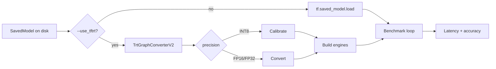
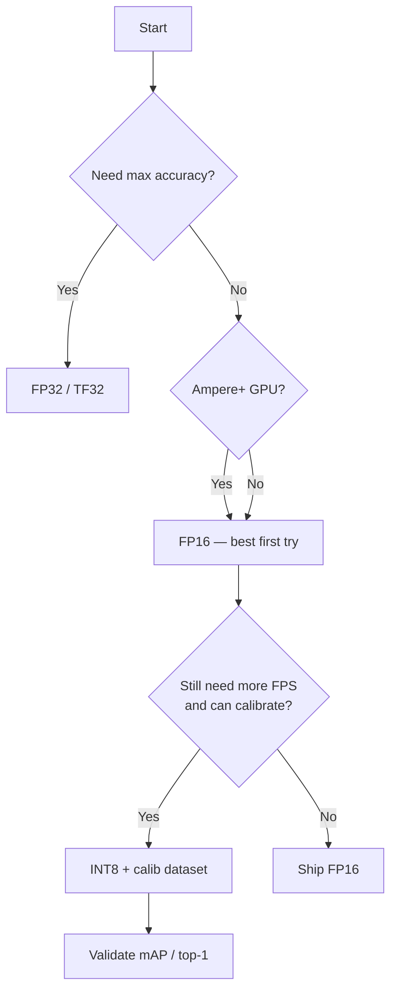
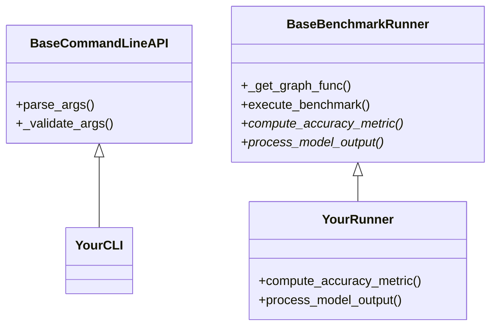

# TENSORRT_DOC — Interactive TF-TRT User & Creator Guide

<p align="center">
  <a href="https://github.com/LITDataScience/tensorrt"></a>
  <a href="https://github.com/LITDataScience/tensorrt/stargazers"></a>
  <a href="LICENSE"></a>
  <a href="CHANGELOG.md"></a>
  <a href="VULNERABILITY.md"></a>
</p>

<p align="center"><b>Star the repo</b> if this guide saves you a weekend of TF-TRT spelunking — it keeps the hardening work visible and funded by attention.<br/>
👉 <a href="https://github.com/LITDataScience/tensorrt">github.com/LITDataScience/tensorrt</a></p>

---

## What this repository is (30 seconds)

This is a **production-minded TF-TRT benchmark & example suite**: ImageNet classification, COCO detection, and Hugging Face transformers — convert SavedModels with TensorRT, measure latency/throughput, check accuracy, and do it with **hardened launchers** (no `eval`, path-safe data loading, optional full-tree model integrity).

| You want… | Go here |
|-----------|---------|
| Run a model **today** | [Quickstart](#2-quickstart-5-minutes) |
| Pick FP16 vs INT8 | [Precision matrix](#5-precision-matrix-choose-your-speed) |
| Ship securely | [Security playbook](#7-security-playbook) |
| Extend / contribute | [Creator guide](#9-creator-guide-extend-the-suite) |
| See what changed | [`CHANGELOG.md`](CHANGELOG.md) |

Official NVIDIA background (upstream concepts): [TF-TRT User Guide](https://docs.nvidia.com/deeplearning/frameworks/tf-trt-user-guide/index.html).

---

## 1. Choose your path

<details open>
<summary><b>🚀 I am a GPU engineer — get FPS numbers</b></summary>

1. Use an **NGC TensorFlow + TensorRT** container (or matching local install).
2. Jump to [Quickstart](#2-quickstart-5-minutes) → Image Classification FP16.
3. Sweep precision with the [matrix](#5-precision-matrix-choose-your-speed).
4. Compare `samples/sec` and `99th_percentile(ms)` in the printed results.

</details>

<details>
<summary><b>🧠 I am an ML researcher — accuracy under TRT</b></summary>

1. Keep `--skip_accuracy_testing` **off**.
2. Use real ImageNet TFRecords / COCO val2017 (not only `--use_synthetic_data`).
3. Compare native TF vs `--use_tftrt --precision=FP16|INT8`.
4. Read [Accuracy & measurement](#6-accuracy--measurement-science).

</details>

<details>
<summary><b>🔐 I am a platform / security engineer</b></summary>

1. Read [`VULNERABILITY.md`](VULNERABILITY.md) + [Security playbook](#7-security-playbook).
2. Always pass `--model_sha256` from `hash_saved_model.py`.
3. Run models in a dedicated user / container; SavedModels execute graph code.
4. Prefer this fork’s hardened `base_script.sh` over any `eval`-based wrappers.

</details>

<details>
<summary><b>🧩 I am a creator — adding models / tasks</b></summary>

1. Study `benchmark_args.py` + `benchmark_runner.py` (shared spine).
2. Follow [Creator guide](#9-creator-guide-extend-the-suite).
3. Add a thin `scripts/<model>.sh` that calls the hardened `base_script.sh`.
4. Document flags in this file + `CHANGELOG.md`.

</details>

---

## 2. Quickstart (5 minutes)

### 2.1 Clone & enter

```bash
git clone https://github.com/LITDataScience/tensorrt.git
cd tensorrt
git submodule update --init --recursive
pip install -e .
```

> If this helped, [⭐ star the repo](https://github.com/LITDataScience/tensorrt/stargazers) so others find the hardened fork.

### 2.2 Sanity: hash helper + unit tests (no GPU)

```bash
python -m unittest discover -s tftrt/examples/tests -v
python tftrt/examples/hash_saved_model.py --help
```

### 2.3 Mental model



### 2.4 First real run (ImageNet / ResNet)

```bash
cd tftrt/examples/image_classification

# Layout expected by scripts:
#   $MODEL_DIR/resnet_v1_50/   ← SavedModel
#   $DATA_DIR/validation-*-of-00128  ← TFRecords

./scripts/resnet_v1_50.sh \
  --data_dir=/data/imagenet/train-val-tfrecord \
  --input_saved_model_dir=/models \
  --use_tftrt --precision=FP16
```

<details>
<summary>Optional: pin model integrity</summary>

```bash
DIGEST=$(python ../hash_saved_model.py --quiet /models/resnet_v1_50)
./scripts/resnet_v1_50.sh \
  --data_dir=/data/imagenet/train-val-tfrecord \
  --input_saved_model_dir=/models \
  --use_tftrt --precision=FP16 \
  --model_sha256=$DIGEST
```

</details>

---

## 3. Repository map

```text
tensorrt/
├── TENSORRT_DOC.md          ← you are here
├── CHANGELOG.md
├── VULNERABILITY.md         ← threat model + fixes
├── IMPROVEMENTS.md          ← research roadmap
├── CRITIQUE.md              ← self-review of hardening
├── README.md                ← front door
├── setup.py                 ← tftrt 0.1.0
└── tftrt/examples/
    ├── benchmark_args.py    ← shared CLI
    ├── benchmark_runner.py  ← TF / TF-TRT runtime
    ├── path_utils.py        ← safe paths + digests
    ├── hash_saved_model.py  ← digest CLI
    ├── tests/               ← unit tests (no GPU)
    ├── image_classification/
    ├── object_detection/
    ├── transformers/
    └── presentations/       ← GTC notebooks
```

---

## 4. Task guides

### 4.1 Image classification (ImageNet)

| Item | Detail |
|------|--------|
| Entry | `image_classification/image_classification.py` |
| Wrappers | `image_classification/scripts/*.sh` → hardened `base_script.sh` |
| Data | TFRecords `validation-*-of-00128` |
| Metric | Top-1 accuracy + latency |

**Supported script models (non-exhaustive):**  
`resnet_v1_50`, `resnet_v1.5_50_tfv2`, `resnet_v2_50`, `inception_v3/v4`, `mobilenet_v1/v2`, `nasnet_*`, `vgg_16/19`, NGC ResNet50 v1.5, sparse/backbone variants.

<details>
<summary>Copy-paste: FP16 vs INT8</summary>

```bash
cd tftrt/examples/image_classification

./scripts/resnet_v1.5_50_tfv2.sh \
  --data_dir=/data/imagenet/train-val-tfrecord \
  --input_saved_model_dir=/models \
  --use_tftrt --precision=FP16

./scripts/resnet_v1.5_50_tfv2.sh \
  --data_dir=/data/imagenet/train-val-tfrecord \
  --input_saved_model_dir=/models \
  --use_tftrt --precision=INT8
```

INT8 auto-calibrates using `--calib_data_dir` (scripts set it equal to `--data_dir`).

</details>

<details>
<summary>Synthetic throughput-only smoke</summary>

```bash
python image_classification.py \
  --data_dir=/data/imagenet/train-val-tfrecord \
  --input_saved_model_dir=/models/resnet_v1_50 \
  --use_synthetic_data --skip_accuracy_testing \
  --use_tftrt --precision=FP16 \
  --num_iterations=200 --num_warmup_iterations=50
```

</details>

### 4.2 Object detection (COCO)

| Item | Detail |
|------|--------|
| Entry | `object_detection/object_detection.py` |
| Deps | `git submodule update --init --recursive` then `./install_dependencies.sh` |
| Data | `$DATA/val2017` + `$DATA/annotations/instances_val2017.json` |
| Metric | COCO mAP (`COCOeval` stats[0]) |
| Layout | Models under `$MODEL_DIR/<name>_640_bs<BATCH>` |

<details>
<summary>Copy-paste: SSD MobileNet FP16</summary>

```bash
cd tftrt/examples/object_detection
git submodule update --init --recursive
./install_dependencies.sh

./scripts/ssd_mobilenet_v2_coco.sh \
  --data_dir=/data/coco2017 \
  --input_saved_model_dir=/models \
  --batch_size=8 \
  --use_tftrt --precision=FP16
```

</details>

**Hardening note:** annotation `file_name` values are resolved with `safe_join_under` — `../` escapes are rejected.

### 4.3 Transformers (BERT / BART)

| Item | Detail |
|------|--------|
| Export | `transformers/generate_save_models_from_hf.py` → `/models/<name>/pb_model` |
| Bench | `transformers/transformers.py` + `scripts/bert_*.sh` / `bart_*.sh` |
| Data | Synthetic token ids today (`DATA_DIR=/tmp` in launcher) |

<details>
<summary>Export + FP16 bench</summary>

```bash
cd tftrt/examples/transformers
python generate_save_models_from_hf.py   # needs transformers + TF

DIGEST=$(python ../hash_saved_model.py --quiet /models/bert_base_uncased/pb_model)
./scripts/bert_base_uncased.sh \
  --input_saved_model_dir=/models \
  --use_tftrt --precision=FP16 \
  --model_sha256=$DIGEST
```

</details>

---

## 5. Precision matrix (choose your speed)



| Mode | Flag | Needs calib | Typical use |
|------|------|-------------|-------------|
| FP32 | `--precision=FP32` | No | Baseline / debug |
| TF32 | FP32 on Ampere+ Tensor Cores (disable with `--no_tf32` in scripts) | No | Default math on modern NVIDIA GPUs |
| FP16 | `--precision=FP16 --use_tftrt` | No | **Default recommendation** |
| INT8 | `--precision=INT8 --use_tftrt` | Yes (`--calib_data_dir`) | Max throughput after accuracy check |

**Incompatible:** `--use_xla` with `--use_tftrt` (enforced in `benchmark_args.py`).  
**Dynamic shapes:** `--use_dynamic_shape` requires TF-TRT; not with INT8 calib in this suite.

---

## 6. Accuracy & measurement science

Printed fields (from `BaseBenchmarkRunner.execute_benchmark`):

| Field | Meaning |
|-------|---------|
| `accuracy` / `mAP` | Task metric (skipped if `--skip_accuracy_testing` or synthetic) |
| `samples/sec` | Throughput after warmup |
| `latency_mean/median/min/max(ms)` | Per-iteration latency |
| `99th_percentile(ms)` | Tail latency |

Tips that separate amateurs from publishable numbers:

1. Warm up enough (`--num_warmup_iterations`, default 100).
2. Lock clocks / power when publishing (nvidia-smi / Nsight).
3. Prefer offline engine build (`--optimize_offline`, default **True**).
4. Don’t mix XLA auto-JIT and TF-TRT in one claim.
5. Record GPU SKU, TRT version, TF version, git SHA next to results.

Roadmap for MLPerf-grade LoadGen: see [`IMPROVEMENTS.md`](IMPROVEMENTS.md).

---

## 7. Security playbook

This fork is intentionally **harder to shoot yourself with** than classic example wrappers.

| Control | How |
|---------|-----|
| No shell injection | `base_script.sh` uses `"${CMD[@]}"` — never `eval` |
| Path traversal | `path_utils.safe_join_under` on COCO paths |
| Temp races | `mkdtemp` / `mktemp -d`, exclusive COCO JSON create |
| Model integrity | `--model_sha256` = **full directory tree** digest |
| Supply chain | HTTPS downloads; Hub export warns; pin revisions in prod |

```bash
# Compute digest once, reuse everywhere
python tftrt/examples/hash_saved_model.py /path/to/SavedModel
```

<details>
<summary>Threat model (short)</summary>

- **In scope:** local CLI misuse, shared-host `/tmp` races, malicious annotations, malicious SavedModels.
- **Out of scope:** sandboxing TF graph execution (use containers / gVisor / dedicated users).
- Full write-up: [`VULNERABILITY.md`](VULNERABILITY.md) · review notes: [`CRITIQUE.md`](CRITIQUE.md).

</details>

---

## 8. CLI reference (shared flags)

From `BaseCommandLineAPI` (`benchmark_args.py`):

| Flag | Purpose |
|------|---------|
| `--input_saved_model_dir` | SavedModel path (**required**) |
| `--output_saved_model_dir` | Where to save TRT-converted model |
| `--data_dir` / `--calib_data_dir` | Validation / INT8 calibration data |
| `--batch_size` | Batch size |
| `--use_tftrt` / `--precision` | Enable TRT + `FP32\|FP16\|INT8` |
| `--optimize_offline` | Build engines before timed loop (default on) |
| `--use_dynamic_shape` | TRT dynamic shape mode |
| `--minimum_segment_size` | Min TF ops per TRT segment |
| `--max_workspace_size` | TRT workspace bytes |
| `--model_sha256` | Full-tree hex digest |
| `--use_synthetic_data` | Repeat one batch (throughput smoke) |
| `--skip_accuracy_testing` | Latency-only |
| `--debug` | Extra tensor shape logs |
| `--gpu_mem_cap` | Soft GPU memory cap (MB); `0` = growth |

Task-specific extras:

- Classification: `--input_size`, `--num_classes`, `--preprocess_method`
- Detection: `--input_size`, `--annotation_path`
- Transformers: `--vocab_size`, `--sequence_length`, …

```bash
python image_classification.py --help
python object_detection.py --help
python transformers.py --help
```

---

## 9. Creator guide (extend the suite)

### 9.1 Architecture you plug into



### 9.2 Checklist for a new model

1. Drop SavedModel under the layout your `base_script.sh` expects.
2. Add `scripts/<model_name>.sh` that only sets `--model_name=...` and calls `base_script.sh`.
3. If preprocess differs, extend the `case` in `base_script.sh` (arrays only — no string `eval`).
4. Validate with FP32 native → FP16 TRT → INT8 TRT.
5. Document in this file + add a `CHANGELOG.md` entry.
6. For detection, ensure annotation paths cannot escape the images root (already enforced).

### 9.3 Don’t regress security

- Never reintroduce `eval` on user strings.
- Never write predictable world-writable paths under `/tmp/fixed_name`.
- Prefer `hash_saved_model.py` in README snippets for third-party weights.
- Keep `set -e` probes inside `if ! …; then` conditionals.

---

## 10. Troubleshooting

<details>
<summary><b>No GPUs has been found</b></summary>

`BaseBenchmarkRunner` requires a GPU. Use an NGC TF container on a CUDA machine, check `nvidia-smi`, and that the process sees devices (`CUDA_VISIBLE_DEVICES`).

</details>

<details>
<summary><b>INT8 accuracy cliff</b></summary>

Increase `--num_calib_inputs`, ensure calib data matches validation distribution, compare FP16 first. Some graphs need QAT upstream — see SmoothQuant / Model Optimizer notes in [`IMPROVEMENTS.md`](IMPROVEMENTS.md).

</details>

<details>
<summary><b>cocoapi / pycocotools missing</b></summary>

```bash
cd tftrt/examples/object_detection
git submodule update --init --recursive
./install_dependencies.sh
```

</details>

<details>
<summary><b>SavedModel integrity check failed</b></summary>

Digest covers **all files** under the directory (not just `saved_model.pb`). Re-hash after any export, and don’t leave symlinks in the tree (rejected).

</details>

<details>
<summary><b>Launcher rejects model_name</b></summary>

Names must be non-empty and must not contain `/` or `..`. Use the script’s expected slug (e.g. `resnet_v1_50`).

</details>

<details>
<summary><b>XLA + TF-TRT error</b></summary>

Drop `--use_xla` when `--use_tftrt` is set. Script `--use_xla_auto_jit` sets `TF_XLA_FLAGS` for the native TF path.

</details>

---

## 11. FAQ

**Q: Is this the TensorRT C++ library itself?**  
A: No. It’s the **TF-TRT examples / verification suite** (TensorFlow ↔ TensorRT). The runtime still comes from NVIDIA TensorRT + TensorFlow builds.

**Q: Why this fork over random scripts on the internet?**  
A: Hardened launchers, integrity hashing, documented vulns, tests, and a creator path — not just copy-pasted `eval` bash.

**Q: Can I use this in CI without a GPU?**  
A: Yes for unit tests (`path_utils`). Conversion/bench needs a GPU runner.

**Q: Where do I ask for features?**  
A: Open an issue on [LITDataScience/tensorrt](https://github.com/LITDataScience/tensorrt/issues) and skim [`IMPROVEMENTS.md`](IMPROVEMENTS.md) first.

---

## 12. Support the project

If this documentation or the hardening work saved you time:

1. ⭐ **[Star the repository](https://github.com/LITDataScience/tensorrt)**  
2. Fork it for your org’s model zoo  
3. Open PRs for new verified models (with FP16/INT8 numbers)  
4. Cite the repo in internal wiki / papers when you publish TF-TRT numbers  

<p align="center">
  <a href="https://github.com/LITDataScience/tensorrt"><b>github.com/LITDataScience/tensorrt</b></a><br/>
  Built for people who ship TensorRT — not just demo it.
</p>

---

## Appendix A — Related docs

| Doc | Role |
|-----|------|
| [`README.md`](README.md) | Front door |
| [`CHANGELOG.md`](CHANGELOG.md) | Version history |
| [`VULNERABILITY.md`](VULNERABILITY.md) | Security findings |
| [`CRITIQUE.md`](CRITIQUE.md) | Self-review of hardening |
| [`IMPROVEMENTS.md`](IMPROVEMENTS.md) | SOTA roadmap |
| [NVIDIA TF-TRT guide](https://docs.nvidia.com/deeplearning/frameworks/tf-trt-user-guide/index.html) | Upstream concepts |

## Appendix B — License

Apache License 2.0 — see [`LICENSE`](LICENSE).
